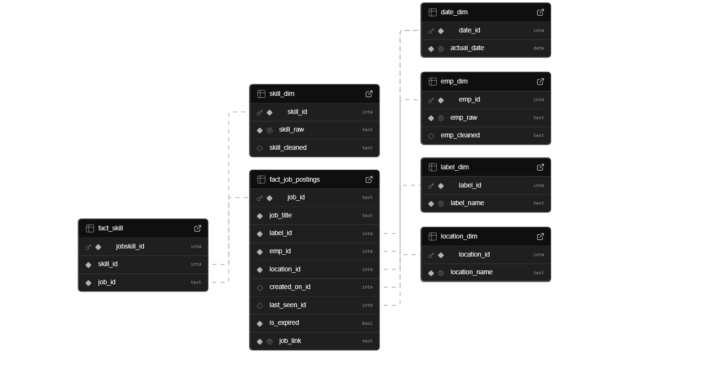
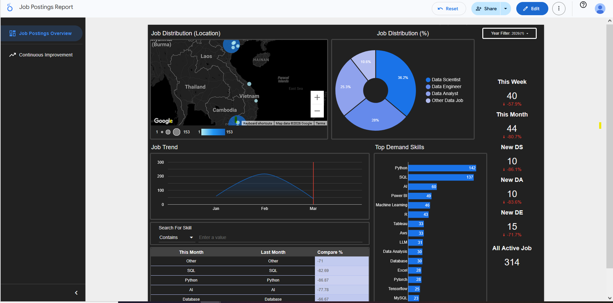
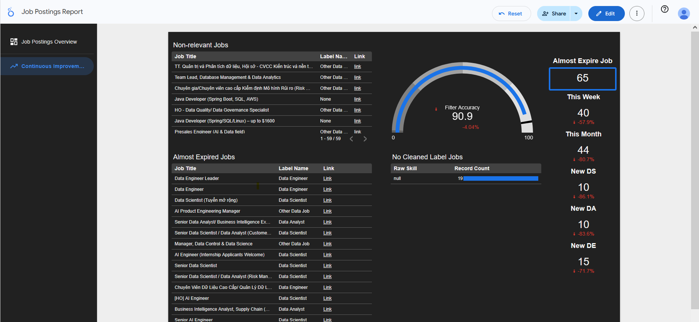

# Data-Driven Job Board: End-to-End ETL Pipeline

## Overview
This project is an automated end-to-end data pipeline designed to consolidate data-related job postings from multiple platforms into a single, filtered, and AI-enriched dashboard. By centralizing data from various sources, this tool eliminates the need to manually browse multiple job boards and uses AI to filter out non-relevant postings with high precision.

The workflow encompasses web scraping, asynchronous data processing, AI-driven relabeling, and storage in a Supabase PostgreSQL database, with final visualization in Google Looker Studio.

Dashboard can be viewed via this: [Link](https://lookerstudio.google.com/reporting/b432a1e5-281d-4bcd-a851-bd838ae45c2a)

## Tech Stack

### Python
* **Extraction:** `requests`, `httpx`, and `aiohttp` for API-based extraction; `playwright` and `playwright-stealth` for browser-based scraping of dynamic content.
* **AI & NLP:** `langchain-groq` and `langchain_openai` for job title relabeling; `scikit-learn` for `cosine_similarity` to deduplicate postings across platforms.
* **Data Processing:** `pandas` and `numpy` for transformation and cleaning.
* **Database Interface:** `sqlalchemy` (ORM) and `psycopg2-binary` for PostgreSQL interactions; `pydantic` for data validation and schema definition.

### Infrastructure & Storage
* **GitHub Actions:** Orchestrates and schedules the multi-stage workflow.
* **Supabase (Postgres):** Serves as the primary data warehouse, utilizing a star schema for analytical efficiency and cron jobs for data maintenance.
* **Google Looker Studio:** Provides a front-end interface for market metrics and workflow performance monitoring.

---

## System Architecture

### 1. Extraction Layer
The pipeline targets major Vietnamese job boards: Careerviet, VietnamWorks, and ITviec.
* **API Integration:** For platforms with exposed internal APIs, `aiohttp` is used for asynchronous requests to maximize throughput.
* **Browser Automation:** For dynamic sites like ITviec, `playwright-stealth` bypasses anti-bot measures. A unique primary key is generated by hashing the job URL via `hashlib`.
* **Robustness:** Implementation of `asyncio.semaphore` (limited to 20 concurrent requests) prevents API overloading, while exponential backoff retry logic ensures resilience against transient network failures.

### 2. Transformation & AI Relabeling
Raw data undergoes a multi-stage cleaning process to ensure high data quality.
* **Pre-filtering:** Initial duplicate removal and keyword-based filtering (e.g., "Data Analyst", "Data Engineer") to reduce the workload for the LLM.
* **AI Relabeling:** Jobs are processed in chunks of 30 records with 25-second delays to respect rate limits. The pipeline uses `meta-llama/llama-4-scout-17b-16e-instruct` via Groq, with an automated fallback to OpenRouter to maintain 100% uptime.
* **Cross-Platform Deduplication:** To identify the same job posted on different sites, the system calculates `cosine_similarity` between `job_title` and `employer_name`. A threshold of 0.75 is applied to account for minor naming variations.

### 3. Loading Layer (Database Modeling)
Data is pushed to Supabase using a Star Schema design to optimize for Online Analytical Processing (OLAP).
* **Dimensional Tables:** Updated using `on_update_do_nothing` logic to handle existing records gracefully.
* **Fact Tables:** The pipeline maps newly updated dimensions to `fact_job_postings` and `fact_skill` tables using SQLAlchemy ORM for type-safe database interactions.

---

## Database Schema
The database is structured to support complex analytical queries regarding market trends and skill requirements.

---

## Analytics & Monitoring

### Market Insights
The Looker Studio dashboard provides real-time answers to critical career questions:
* Which skills are most in-demand for specific data roles?
* What are the current job volume trends compared to previous months?
* Which companies are the most active recruiters in the data space?

### Workflow Performance
A dedicated monitoring page tracks the health of the ETL process:
* Accuracy of the initial regex filters.
* Identification of "non-relevant" jobs that bypassed filters for future logic refinement.
* Tracking records with missing `skill_cleaned` data for manual verification.

---

## Future Roadmap
* **Automated Classification:** Extract industry fields directly from employer descriptions using NLP.
* **Local LLM Integration:** Transition to small local models for skill relabeling to reduce external API dependency.
* **Advanced Anti-Detection:** Integrate proxy rotation and advanced header rotation for broader scraping capabilities.
* **Workflow Analytics:** Use the GitHub API to pull and visualize workflow success rates and execution times.
