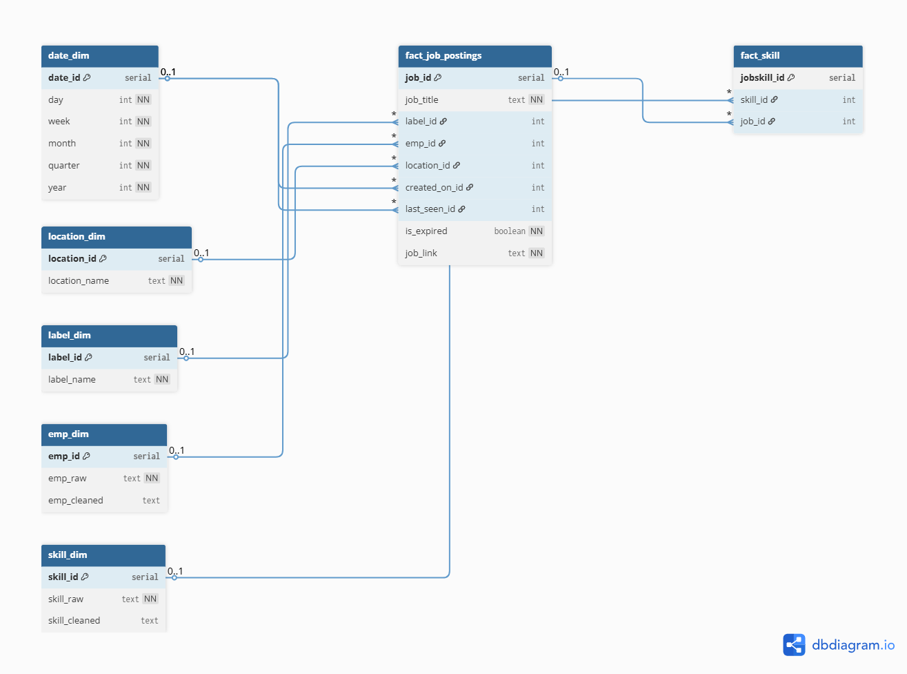

# Scraping-jobs
This is and end to end project from scraping jobs data, processing, relabelling using AI and push data into SQL tables, visualizing data base one the tables

# Tech Stack:

### - **Python (with the following libraries):**
   * requests, httpx, aiohttp for pulling data from websites' apis
   * playwright, playwright-stealth to scrape data using browser session for websites that have no exposed internal APIs
   * langchain-groq, langchain_openai to relabel job titles for higher accuracy
   * pandas, numpy, scikit-learn to clean, transform and filter out duplicate job postings, prepare job data for SQL database update
   * sqlalchemy, psycopg2-binary, pydantic use to define table schema and interact with postgresql database with ORM

### - **Supabase (Postgresql) to store data:**
   * Design database with star schema to handle the analytical purposes

   * Utilizing cron jobs to check for expired jobs
